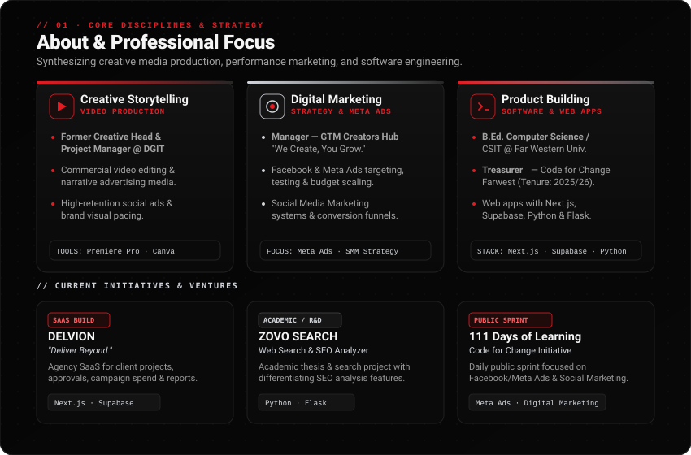
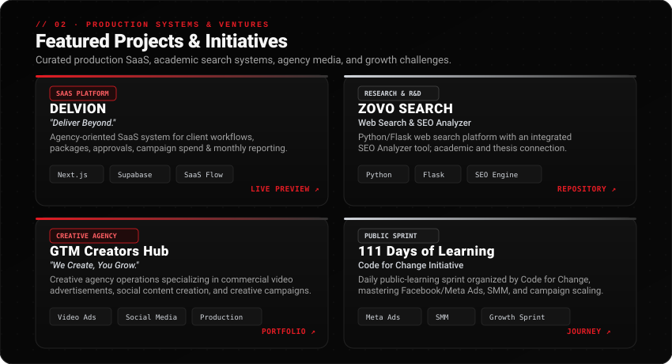
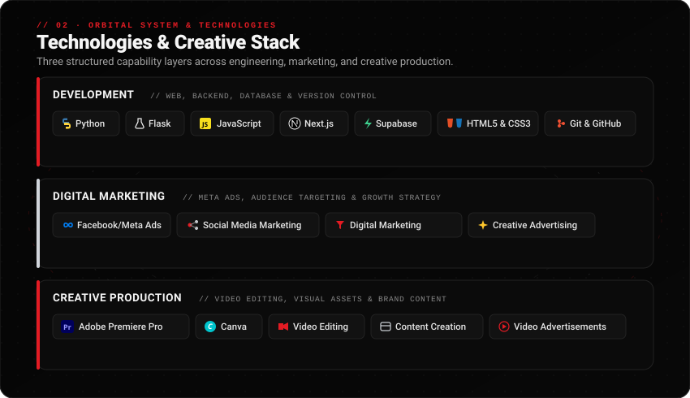

# SURAJ MAHAR

**Creative mind × Digital marketer × Technology enthusiast × Product builder**  
*Mahendranagar, Nepal*

  <em>&quot;I blend creative storytelling, digital marketing and practical technology to build useful digital experiences.&quot;</em>

  
  
  
  
  

---

<!-- 1. HERO BANNER -->

  

 

<!-- 2. ABOUT & DISCIPLINES -->

  

 

<!-- 3. FEATURED PROJECTS SHOWCASE GRAPHIC -->

  

 

<!-- FEATURED PROJECTS INTERACTIVE DIRECTORY -->

  <table width="100%">
    <thead>
      <tr style="border-bottom: 2px solid #E31B23;">
        <th align="left">Project</th>
        <th align="left">Focus / Domain</th>
        <th align="left">Architectural Highlights &amp; Scope</th>
        <th align="center">Action Link</th>
      </tr>
    </thead>
    <tbody>
      <tr>
        <td><strong>DELVION</strong></td>
        <td><code>SaaS Platform</code></td>
        <td>Agency-oriented SaaS system for managing client workflows, project milestones, approval pipelines, campaign spend tracking, and automated monthly reporting. Developed with Next.js and Supabase.</td>
        <td align="center"><a href="https://delvion-preview.vercel.app/"><strong>Live Preview ↗</strong></a></td>
      </tr>
      <tr>
        <td><strong>ZOVO SEARCH</strong></td>
        <td><code>Search &amp; SEO Engine</code></td>
        <td>Python and Flask web search project featuring an integrated SEO Analyzer as its primary differentiator. Developed in connection with academic thesis research.</td>
        <td align="center"><a href="https://github.com/surajmhar/ZOVO_SEARCH"><strong>Repository ↗</strong></a></td>
      </tr>
      <tr>
        <td><strong>GTM CREATORS HUB</strong></td>
        <td><code>Creative Agency</code></td>
        <td>Full-scale creative agency operations specializing in commercial video advertisements, dynamic social media campaigns, visual storytelling, and brand growth. <em>&quot;We Create, You Grow.&quot;</em></td>
        <td align="center"><a href="https://maharsuraj.com.np"><strong>Portfolio ↗</strong></a></td>
      </tr>
      <tr>
        <td><strong>111 DAYS OF LEARNING</strong></td>
        <td><code>Public Challenge</code></td>
        <td>Daily public learning sprint organized by Code for Change, documenting deep execution across Facebook/Meta Ads, campaign optimization, and Social Media Marketing.</td>
        <td align="center"><a href="https://linkedin.com/in/surajmahar"><strong>Follow Sprint ↗</strong></a></td>
      </tr>
    </tbody>
  </table>

 

<!-- 4. TECH STACK & ORBITS -->

  

 

<!-- 5. ID DASHBOARD -->

  

 

<!-- 6. CONNECT SECTION GRAPHIC -->

  

 

<!-- DIRECT CONNECT & COMMUNICATION HUB -->

  <h3>⚡ Direct Connect &amp; Communication Channels</h3>
  
<em>Click any button below to connect directly across verified communication platforms:</em>

  
  

    
    &nbsp;
    
    &nbsp;
    
  

  

    
    &nbsp;
    
  

   

  <table width="90%">
    <tbody>
      <tr>
        <td width="30%"><strong>🌐 Official Website</strong></td>
        <td><a href="https://maharsuraj.com.np"><code>maharsuraj.com.np</code></a></td>
        <td>Personal homepage, creative showcases &amp; articles.</td>
      </tr>
      <tr>
        <td><strong>💼 LinkedIn Profile</strong></td>
        <td><a href="https://linkedin.com/in/surajmahar"><code>linkedin.com/in/surajmahar</code></a></td>
        <td>Professional updates, agency insights &amp; network.</td>
      </tr>
      <tr>
        <td><strong>📸 Instagram Media</strong></td>
        <td><a href="https://www.instagram.com/surajmaharofficial/"><code>@surajmaharofficial</code></a></td>
        <td>Commercial video ads, creative reels &amp; production.</td>
      </tr>
      <tr>
        <td><strong>💻 GitHub Repositories</strong></td>
        <td><a href="https://github.com/surajmhar"><code>github.com/surajmhar</code></a></td>
        <td>Open-source code, web applications &amp; experiments.</td>
      </tr>
      <tr>
        <td><strong>✉️ Direct Email</strong></td>
        <td><a href="mailto:surajmahar122@gmail.com"><code>surajmahar122@gmail.com</code></a></td>
        <td>Project inquiries, client proposals &amp; collaborations.</td>
      </tr>
    </tbody>
  </table>

---

  Designed with precision for Suraj Mahar · Mahendranagar, Nepal · Built with authentic SVG vectors &amp; verified credentials

